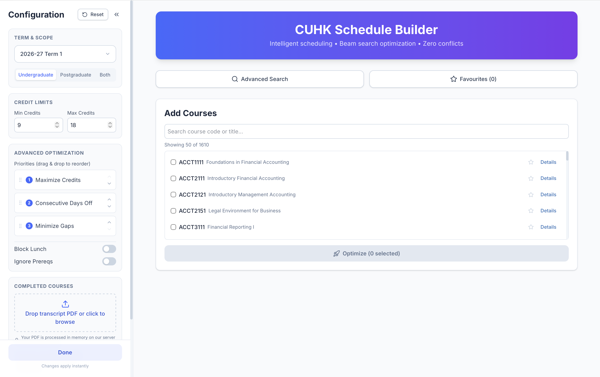

# CUHK Timetable Builder

<!-- [](https://cuhk-schedule-builder.netlify.app) -->
[](https://www.python.org/)
[](https://react.dev/)
[](LICENSE)

Unofficial tool that generates conflict-free CUHK timetables using beam-search
optimization. Enter the courses you're considering, tune constraints (credit
limits, priorities, lunch blocks), optionally upload your transcript to filter
out courses whose prerequisites you haven't met, and browse ranked schedules.

> ⚠️ **Unofficial student project.** Not affiliated with or endorsed by CUHK.
> Always verify schedules on official CUHK systems before enrolling.

<!-- 🔗 **Live app:** [https://cuhk-schedule-builder.netlify.app](https://cuhk-schedule-builder.netlify.app)
*(Temporarily unavailable — hosting credits exhausted. Will be restored by 12/09/2026) -->

## Screenshot



## Features

- **Beam-search schedule builder** — ranks all valid (conflict-free) schedules by your prioritized criteria: maximize credits, consecutive days off, minimal gaps between classes
- **Priority reordering** — drag & drop (or arrow buttons) to change what the builder values most
- **Prerequisite checking** — upload your transcript PDF (parsed in memory, never stored) or type completed courses manually; ineligible courses are flagged or excluded
- **Must-take constraints** — force specific courses into every generated schedule
- **Advanced search** — filter by instructor, subject, department, and course level
- **Course level filter** — undergraduate only, postgraduate only, or both
- **Lunch blocking** — reserve a daily time window free of classes
- **Credit limit guardrails** — warns when your limits deviate from CUHK's 9–18 unit normative load (6 units in summer)
- **TBA handling** — courses with unannounced times are kept out of the grid but shown separately
- **Favourites** (saved locally in your browser) and **PNG export** of timetables

## How It Works

1. Each selected course is expanded into its possible section combinations
   (e.g. one LEC + one of five TUT sections).
2. Beam search explores combinations, pruning any with time conflicts,
   lunch-window overlaps, prerequisite violations, or credit-limit breaches.
3. Surviving schedules are scored by weighted priorities (your #1 priority
   counts ~10× your #2, which counts ~10× your #3).
4. The best schedules are returned and rendered in the timetable grid.

## Architecture

```
┌─────────┐  static site (JS bundle)  ┌───────────┐  /api/* (reverse proxy,   ┌──────────────────────┐
│ Browser │ ◀──────────────────────── │  Netlify  │   same-origin — no CORS) ─▶ Render: FastAPI       │
└─────────┘                           │   (CDN)   │                           │ • beam-search API    │
                                      └───────────┘                           │ • transcript parser  │
                                                                              │ • data/*.json (LRU-  │
                                                                              │   cached per term)   │
                                                                              └──────────────────────┘
```

- The browser only ever talks to Netlify (one origin); `/api/*` is proxied
  server-side to Render, so no CORS configuration is needed.
- Render's free tier sleeps when idle — the first request after a quiet
  period may take ~30–60 s to wake the service.

## Tech Stack

| Layer | Tools |
|---|---|
| Frontend | React 19 · Vite · Tailwind CSS v4 |
| Backend | FastAPI · Uvicorn (Python 3.11+) |
| Builder Engine | Custom beam-search over course/section combinations |
| Hosting | Netlify (frontend + `/api` proxy) · Render (API, free tier) |

## Project Structure

```
.
├── backend/
│   └── main.py               # FastAPI app: routes, CORS, caching
├── src/
│   ├── parsers/
│   │   ├── course_parser.py  # JSON → normalized course objects
│   │   └── prereq_parser.py  # prerequisite/exclusion text → structured rules
│   └── builder/              # scheduling engine
│       ├── beam_search.py
│       └── constraints.py
├── config.py                 # paths, credit limits, scoring weights
├── transcript_parser.py      # transcript PDF → completed course codes
├── data/                     # course JSON data (see Data Sources below)
├── frontend/
│   ├── public/
│   │   ├── favicon.svg
│   │   ├── apple-touch-icon.png
│   │   ├── icon-192x192.png
│   │   ├── icon-512x512.png
│   │   ├── manifest.json
│   │   └── screenshot.png
│   └── src/
│       ├── components/       # Sidebar, MainContent, TimetableView, CourseModal
│       ├── utils/            # time formatting, building-name abbreviations
│       └── api.js            # API client (relative URLs; proxied in prod)
├── render-build.sh           # downloads course data on Render deployment
├── netlify.toml              # Netlify build config + /api redirect rules
├── requirements.txt
└── README.md
```

## Getting Started

### Prerequisites

- Python 3.11+
- Node.js 20+ (22 LTS recommended)
- macOS/Linux shell (Windows: WSL or Git Bash recommended)

### Step 1 — Set up course data

This repository uses course data from the [CUtopia Labs community dataset](https://github.com/cutopia-labs/cuhk-course-data). 

**Option A: Use pre-scraped data (recommended)**
```bash
# Clone the dataset repository (JSON files are in courses/)
git clone https://github.com/cutopia-labs/cuhk-course-data.git temp-data
# Copy the JSON files to your data/ directory
cp temp-data/courses/*.json data/
# Clean up
rm -rf temp-data
```

**Option B: Generate your own data using the scraper**
```bash
# If you prefer to scrape fresh data yourself:
git clone https://github.com/mikezzb/cuhk-course-scraper.git
cd cuhk-course-scraper
pip install -r requirements.txt
python -c "from cuscraper import CourseScraper; cs = CourseScraper(); cs.parse_all()"
cp courses/*.json ../data/
cd ..
```

> **Note:** The `data/` directory should contain JSON files named `<SUBJECT>.json` (e.g., `CSCI.json`, `MATH.json`). Each file contains courses for that subject.

### Step 2 — Run the backend

```bash
pip install -r requirements.txt
uvicorn backend.main:app --reload        # from the repo root
```

Interactive API docs: http://localhost:8000/docs

| Endpoint | Purpose |
|---|---|
| `GET /api/courses?term=2026-27 Term 1` | All parsed courses for a term |
| `POST /api/optimize` | Run beam search over selected courses |
| `POST /api/upload-transcript` | Parse a transcript PDF (multipart field `file`) |

### Step 3 — Run the frontend

```bash
cd frontend
npm install
npm run dev
```

Open http://localhost:5173 — the Vite dev server proxies `/api/*` to
`localhost:8000` automatically (see `vite.config.js`). No environment
variables needed.

## Supported Terms

The UI currently offers: `2026-27 Term 1`, `2026-27 Term 2`,
`2026-27 Summer Session`.

### Updating data for a new academic year

1. Obtain updated course data from the [CUtopia dataset](https://github.com/cutopia-labs/cuhk-course-data) or re-run the scraper for the new year.
2. Replace the files in `data/` (keeping the `<SUBJECT>.json` naming).
3. If the term strings change (e.g. `2027-28 Term 1`), update:
   - the `<option>`s in `frontend/src/components/Sidebar.jsx`
   - `DEFAULT_CONFIG.term` in `frontend/src/App.jsx`
4. Commit & push — Netlify and Render redeploy automatically.

## Troubleshooting

| Symptom | Cause & fix |
|---|---|
| First page load hangs ~30–60 s | Normal on Render's free tier — the instance sleeps when idle and boots on demand. Subsequent requests are fast. |
| 404 "No courses parsed" | `data/` is empty, or filenames don't match `<SUBJECT>.json`. On Render, check build logs for data download. |
| "Target term … not found" | The term string in the UI isn't among the `terms` keys in your scraped JSON — align them (see Supported Terms). |
| PDF upload fails immediately | `python-multipart` missing from your Python environment. |
| Site loads but course list never appears; console shows HTML where JSON was expected | The `/api` proxy isn't active — check `netlify.toml` redirects are deployed and that Netlify's Base directory field is empty. |
| Schedules ignore your priority order | Ensure the frontend sends `priorities` and the backend model expects that exact field name. |

## Privacy

Transcript uploads are parsed **entirely in memory** and never written to
disk or logged. Favourites and manual course entries live only in your
browser's `localStorage` — nothing about your selections is stored
server-side.

## Data Sources & Attribution

Course schedule data is sourced from the open-source community dataset maintained by the [CUtopia Labs](https://github.com/cutopia-labs) team at [cutopia-labs/cuhk-course-data](https://github.com/cutopia-labs/cuhk-course-data) — thanks to their team for maintaining this resource.

The data is collected from CUHK's course offering pages. The course scraping tool [mikezzb/cuhk-course-scraper](https://github.com/mikezzb/cuhk-course-scraper) (credit [@mikezzb](https://github.com/mikezzb)) is available as an alternative for generating fresh data.

### ⚠️ Important Licensing and Usage Notice

- **Course data** is sourced from **CUHK's course offerings** and remains subject to **CUHK's terms of use**.
- The **MIT license** in this repository applies **only to the code** (the software implementation, parser, builder engine, frontend, etc.).
- **Neither the CUtopia data repository nor the scraper repository** provides an explicit license for the scraped course data. The data itself is factual information from public university course offerings.
- **This project does not claim ownership** of the course data; it is provided for educational and personal planning purposes.
- **Users are responsible** for ensuring their use of the data complies with all applicable terms and regulations.

**Please respect CUHK's data policies and use this tool responsibly.**

### Data Generation Options

This repository provides two approaches for obtaining course data:

1. **Pre-scraped dataset** (recommended): Use the community-maintained data from CUtopia Labs
2. **Self-scraped data**: Generate fresh data using the cuhk-course-scraper tool

Neither option is redistributed with this repository; users obtain data via the linked resources.

## License

The **code** in this repository is released under the [MIT License](LICENSE).

**Third-party resources are linked, not copied**, and remain under their respective owners' terms. **Course data** you use from the CUtopia dataset or generate yourself via the scraper derives from CUHK's public course offerings and remains subject to CUHK's terms.

## Acknowledgements

- [@mikezzb](https://github.com/mikezzb) — [cuhk-course-scraper](https://github.com/mikezzb/cuhk-course-scraper)
- [CUtopia Labs](https://github.com/cutopia-labs) — [cuhk-course-data](https://github.com/cutopia-labs/cuhk-course-data) and prior art in the CUHK student-tools space